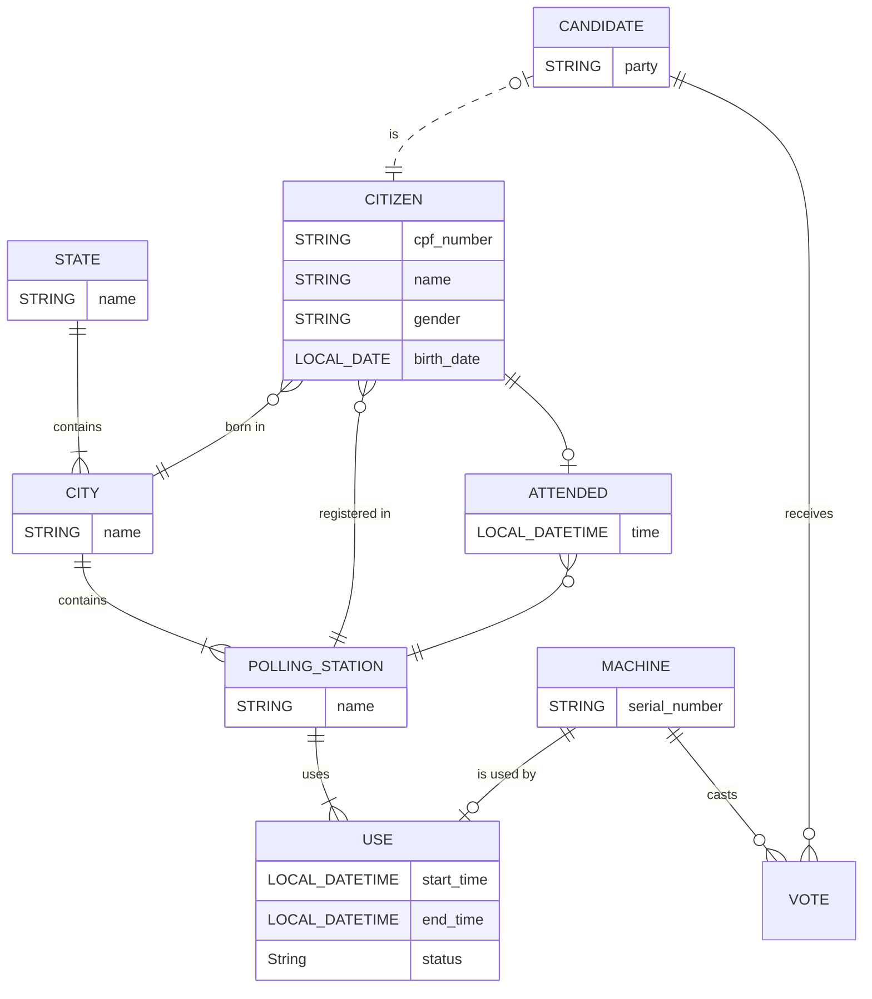

# TSE Online

`Gabriel Malosto e Lucas Paiva`

O sistema de urnas eletrônicas exige uma operação muito complexa para envio das urnas, operacionalização e contagem de votos. Para isso, o TSE lhe contrata para criar o banco de dados que permitirá o acompanhamento da logística das eleições, o cadastro de candidatos, a geração do relatório final de cada urna e a contagem final.

## Modelo Entidade-Relacionamento

