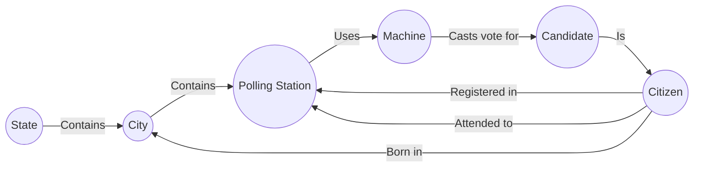

# Diagrama

```mermaid

flowchart LR
    State((State))
    City((City))
    PollingStation((Polling Station))
    Machine((Machine))
    Citizen((Citizen))
    Candidate((Candidate))

    State -->|Contains| City
    City -->|Contains| PollingStation
    PollingStation -->|Uses| Machine
    Machine -->|Casts vote for| Candidate
    Candidate -->|Is| Citizen
    Citizen -->|Born in| City
    Citizen -->|Registered in| PollingStation
    Citizen -->|Attended to| PollingStation

```
